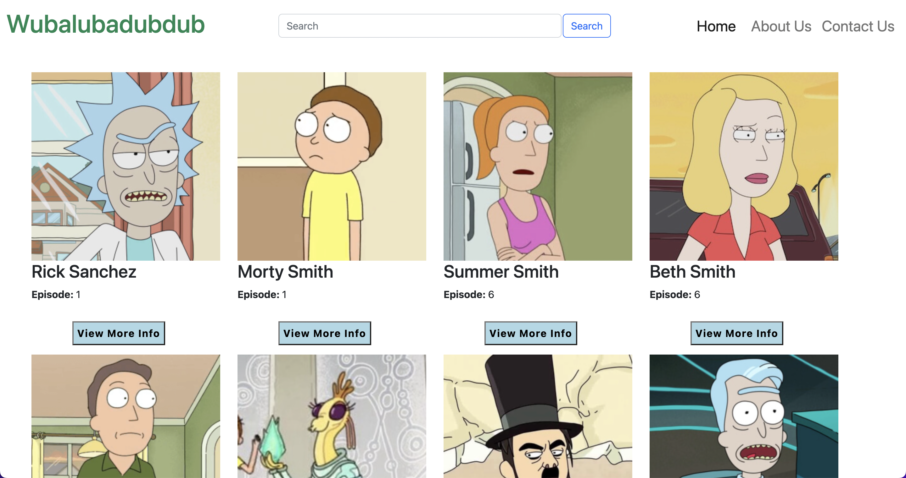
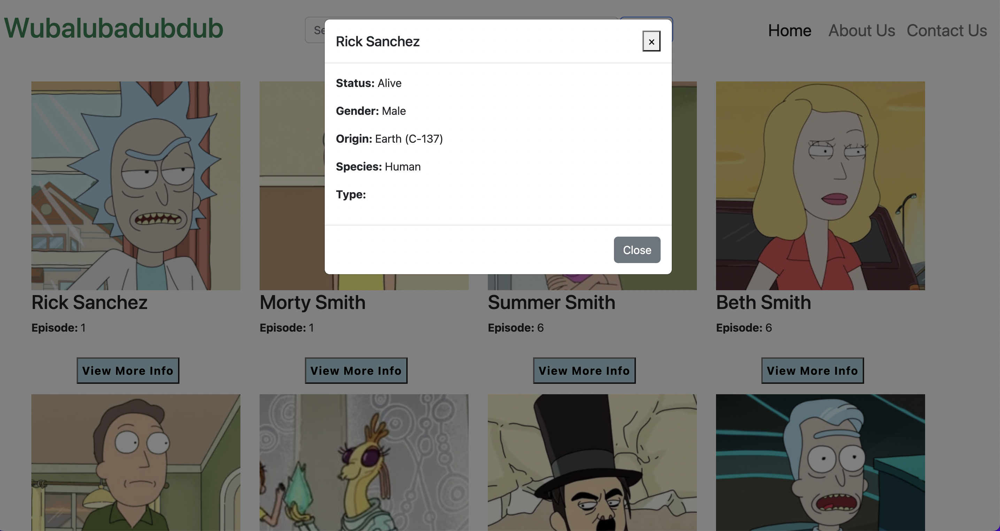
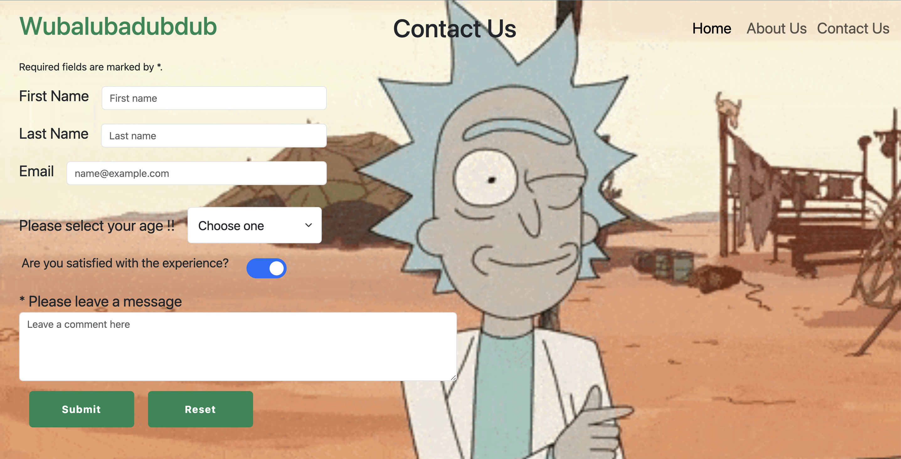
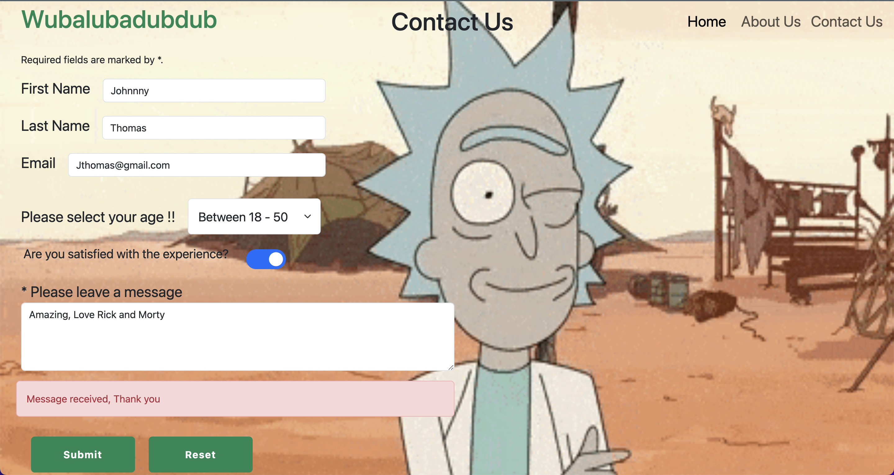
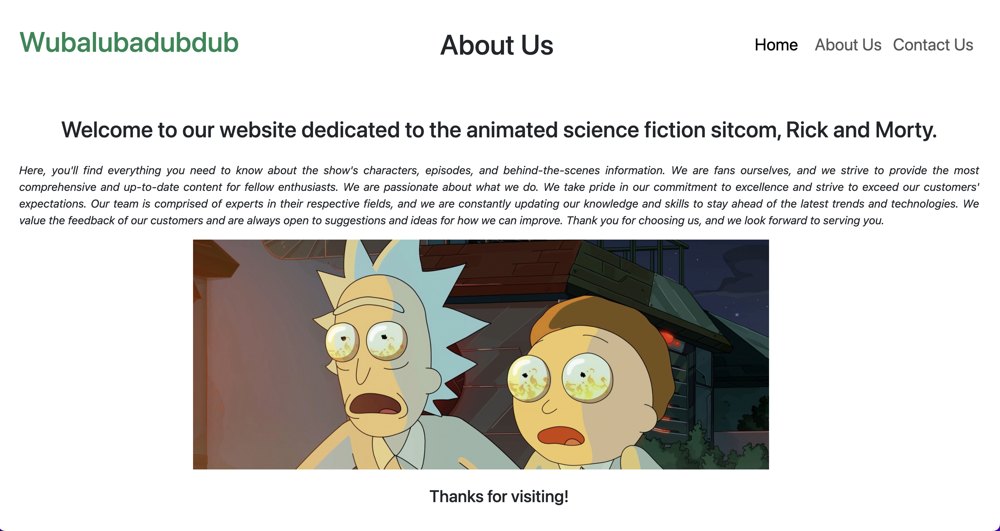

# Rickcyclopedia

## About Webpage
[Rickcyclopedia](https://thefoodiehub.netlify.app/) was created using HTML, CSS, JavaScript, and Bootstrap 5. Used Rick and Morty API to retrieve data about characters from the popular animated series "Rick and Morty." The webpage allows users to view information about characters from the show Rick and Morty, including their name, image, and first appearance episode.

# Watch Presentation
[Presentation](https://us06web.zoom.us/rec/share/LDWd5a7G--cVNBe4i5te83u0400-xRfH0xwe5isZzBnYmgbaXxVNokU8nZ7Fj2Db.08PpInZBd5zEzLWA)

Passcode: W#V8*#TQ

### Features

* Pagination: Allows users to navigate between different pages of character information.
* Modal Window: Allows users to view more detailed information about a character by clicking "View More Info" button.
* Hamburger menu: A responsive menu that appears when the screen size is below a certain breakpoint.
* Grid system: The webpage uses the Bootstrap 5 grid system to create a responsive layout.
* CSS selectors: Used to select and style specific HTML elements on the webpage.
* Layout: Fully responsive and uses the grid system in Bootstrap 5.

### Software Used

* HTML
* CSS
* JavaScript
* Bootstrap 5
* Rick and Morty API

### Screenshots

#### Home Page

---

#### Modal Window

---

#### Contact Us 

---

---

#### About Us 

---

## Installation

* Download the code from the repository.
* Open the index.html file in your browser.

## Usage

* On the homepage, characters are displayed with their name, image, and first appearance.
* Users can navigate through the different pages of characters using the pagination at the bottom of the page.
* Users can also search for a specific character using the search bar at the top of the page.
